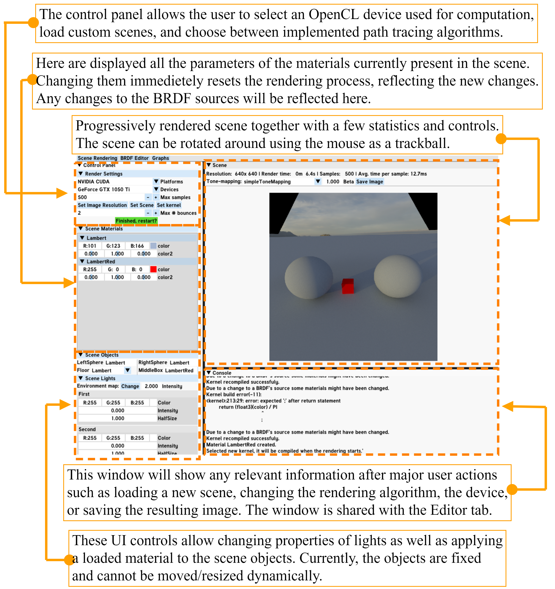
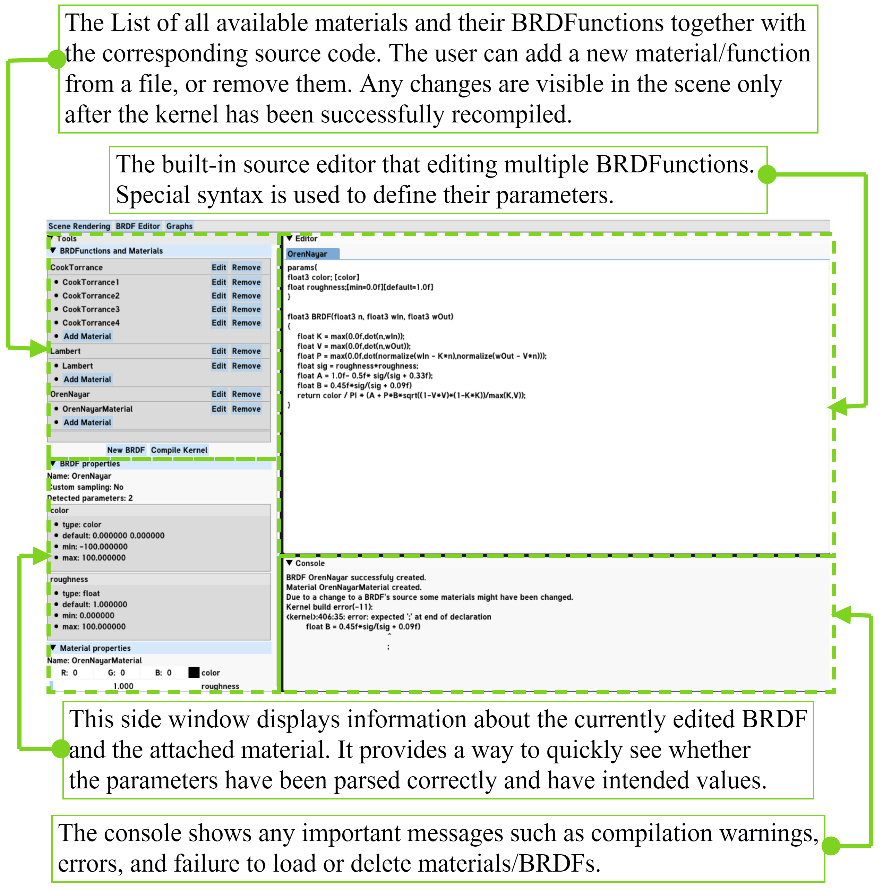
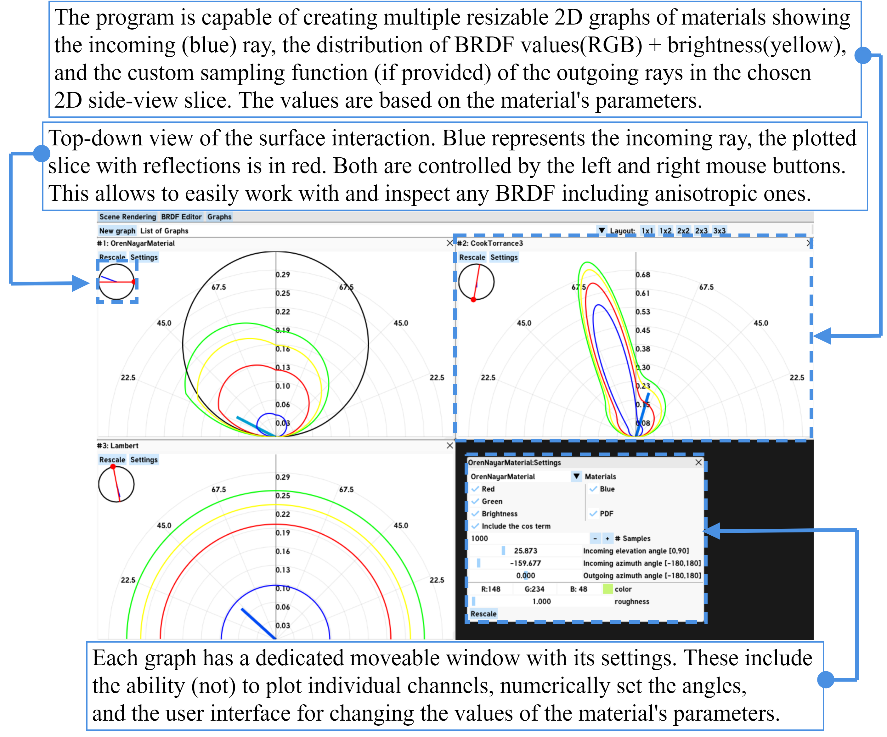

# **BRDF Editor**
BRDF Editor is an application for rapid prototyping of BRDF functions. 
It is capable of rendering with various algorithms - from direct-lighting only to full path tracing with area lights and MIS.
The program was designed with extensibility in mind, so writing new algorithms
require little change in the source code.


The first image shows the Stanford Bunny created by [Stanford Computer Graphics Laboratory](http://graphics.stanford.edu/data/3Dscanrep/).

## Features
1. User-supplied definitions of parametrized BRDFs.
2. Capable of rendering a general scene(JSON) including indirect area light
illumination and `.obj` models.
3. Takes advantage of massively parallel GPU architecture in order to be responsive in simple scenes.
4. Progressive rendering immediately reacting any changes in the scene or functions' parameters.
5. Support for optional custom importance sampling functions for the
written BRDFs.
6. Emphasis both on flexibility and extensibility. Support more complex scenes and rendering algorithms or trade this complexity for additional performance.
7. Support for 2D graphs visualizing the BRDFs' properties.
8. Implementation of the path tracing algorithm and a couple of
well-known BRDFs.

# LICENSE
My code is released under MIT license, `external/` and `glfw-3.2.1` contain external libraries with their own licenses. Same goes for the Standford Bunny model in
`res/Models`.

# Quickstart
### Prerequisites:
- CMAKE or Visual Studio 2017+ which can open CMAKE projects.
- A device with OpenCL 1.2 support and up-to-date drivers.
- GPU with ideally OpenGL 4.5, might work on 3.3+, might not.

### Compilation:
1. Clone the repository.
2. Run CMAKE, e.g.:
```
mkdir build && cd build
cmake ../
```
3. Compile the generated project. (make/Visual Studio).
4. The content of `res/` folder should be automatically added to the  binary folder, if not, do it manually. **Copy the content, not the folder itself**.
5. Run the executable.

### After startup
1. Select an OpenCL platform. It should find all installed OpenCL implementations.
2. Select desired OpenCL device. 
    - Green device means OpenCL OpenGL interop is available.
    - Yellow will have to copy the OpenCL buffer to the OpenGL texture each frame which might greatly reduce interactivity.
    - Red is unusable for some reason.

    Colors are based on information provided by the drivers, which, in my experience, was not always correct. So if it crashes, just try something else, but bugs are also probable. In that case feel free to reach to me.
3. Start rendering! A default scene is automatically loaded, so you can play with it.
Note that the application might freeze for a second while the kernels are compiled for the first time.





More information can be found in `poster.pdf` I made for the presentation.


